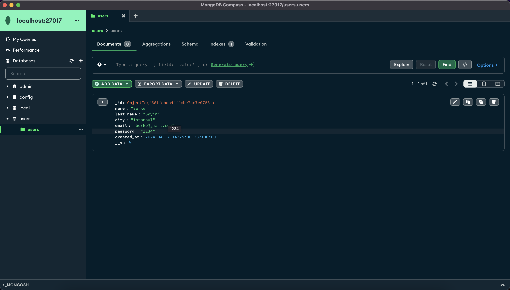

# App Deployment - Building Images With Docker & Deploying Apps With Kubernetes

This is a multi-container Sign Up Form project. `Dockerfile` and `Docker Compose` used here to run the application on 3 containers. Follow the contents for details and usage.

## Table of Contents

1. [Introduction](#intro)
2. [Technologies](#tech)
3. [Dockerizing Frontend](#dockerize-fe)
4. [Dockerizing Backend](#dockerize-be)
5. [Docker Compose Configuration](#compose)
6. [Application Running With Containers](#app-containers)
7. [Push Images To Dockerhub](#dockerhub)
8. [Setup Minikube Cluster](#minikube)
9. [About The Project](#project-k8s)
10. [External Configuration With ConfigMap and Secret](#configmap-secret)
11. [Deploy MongoDB Database](#deploy-mongo)
12. [Deploy Web App Backend](#deploy-be)
13. [Deploy Web App Frontend](#deploy-fe)
14. [Create All Components In Kubernetes](#create-components)
15. [Get Information About K8S Components](#get-info)
16. [Access Web App In Browser](#access)

## 1.Introduction <a name="intro"></a>

This is a multi-container Sign-Up Form application running on frontend, backend and database containers built with `Dockerfile` and `Docker Compose`.

This is a multi-container Sign Up Form project. This repository contains all the necessary code and configurations to deploy a fully functional Sign Up form application, comprising frontend, backend, and database components. By containerizing each part with Docker and utilizing Docker Compose, deployment becomes seamless and efficient.

## 2.Technologies <a name="tech"></a>

The technologies used to develop and run the project listed below:

### Frontend

- TypeScript
- React
- React - Semantic UI

### Backend

- TypeScript
- Express (Node.js)

### Database

- MongoDB

### Containerization

The application runs on 3 containers for frontend, backend and database components.

- Dockerfile (Building image)
- Docker compose (Running multi-container application)

## 3.Dockerizing Frontend <a name="dockerizing-fe"></a>

The frontend part of the application is containerized using Docker. This ensures that the frontend environment remains consistent across different platforms and deployments. To Dockerize the frontend, follow the steps outlined in the frontend `Dockerfile`.

```dockerfile
FROM node:21-slim
WORKDIR /react-app
COPY package.json .
RUN npm install
COPY src/ .
COPY . .
RUN npm install -g live-server
RUN npm run build
EXPOSE 8080
CMD ["live-server", "dist"]
```

The `.dockerignore` file is used also here to specify files and directories that should be excluded from the context when building the Docker image.

The frontend image is built using `Docker Compose` in `docker-compose.yaml` configuration file for frontend part of the application.

## 4.Dockerizing Backend <a name="dockerizing-be"></a>

Similar to the frontend, the backend of the application is also Dockerized. This ensures easy deployment and scalability. Refer to the backend Dockerfile for instructions on Dockerizing the backend.

```dockerfile
FROM node:21-slim
WORKDIR /usr/src/app
COPY package.json .
RUN npm install
COPY . .
RUN npm run build
EXPOSE 3000
CMD ["node", "./dist/src/server.js"]
```

The `.dockerignore` file is used also here to specify files and directories that should be excluded from the context when building the Docker image.

The backend image is also built using `Docker Compose` in `docker-compose.yaml` configuration file for backend part of the application.

## 5.Docker Compose Configuration <a name="compose"></a>

`Docker Compose` is a tool for defining and running `multi-container` applications. The project runs 3 containers with compose configuration.

The `docker-compose.yml` file in the root directory contains the configuration for running the entire application stack, including frontend, backend, and the MongoDB database.

```yaml
version: "3.4"
services:
  signup-backend:
    container_name: signup-be-c
    build: ./backend
    ports:
      - 3000:3000
  signup-frontend:
    container_name: signup-fe-c
    build: ./frontend
    ports:
      - 9000:8080
  mongodb:
    container_name: mongo-db
    image: mongo
    ports:
      - 27017:27017
    volumes:
      - todo-app-data:/data/db
volumes:
  todo-app-data:
```

Locate the root directory of the project at the terminal. Execute the command to run containers defined at `docker-compose.yaml` file.

Build

```bash
docker-compose build
```

Images Pulled

```bash
docker images
```

```bash
REPOSITORY                           TAG       IMAGE ID       CREATED          SIZE
app-deployment-signup-frontend       latest    0971800f6a75   8 seconds ago    775MB
app-deployment-signup-backend        latest    075811fe9231   52 seconds ago   601MB
mongo                                latest    3105b19333c4   4 weeks ago      720MB
```

The names for the images will be changed before pushing them to Docker registry (Dockerhub).

Run

```bash
docker-compose up
```

```
[+] Running 5/5
✔ Network app-deployment_default         Created 0.0s
✔ Volume "app-deployment_todo-app-data"  Created 0.0s
✔ Container mongo-db                     Created 0.1s
✔ Container signup-fe-c                  Created 0.1s
✔ Container signup-be-c                  Created 0.1s
```

## 6.Application Running With Containers<a name="app"></a>

The 3 containers for frontend, backend and database components are up and running after executing `docker-compose up` command. List running containers with this command:

```bash
docker ps
```

```bash
CONTAINER ID   IMAGE                            COMMAND                  CREATED         STATUS         PORTS                      NAMES
47608cdfd553   mongo                            "docker-entrypoint.s…"   2 minutes ago   Up 2 minutes   0.0.0.0:27017->27017/tcp   mongo-db
4778aa45c0eb   app-deployment-signup-backend    "docker-entrypoint.s…"   2 minutes ago   Up 2 minutes   0.0.0.0:3000->3000/tcp     signup-be-c
4cede8edde35   app-deployment-signup-frontend   "docker-entrypoint.s…"   2 minutes ago   Up 2 minutes   0.0.0.0:9000->8080/tcp     signup-fe-c
```

- Frontend: `http://localhost:9000`


- Backend: `http://localhost:3000`


- Request from Postman


- Database: `mongodb://localhost:27017`



## 7.Push Images To Dockerhub <a name="dockerhub"></a>

### Push Backend Image

Create new public repository with name `dockerhub-username/signup-form-backend` at `Dockerhub`.


First of all, save the new image by finding the container ID (using `docker container ls`) and then committing it to a new image name.

```bash
docker container ls -a
```

```bash
CONTAINER ID   IMAGE                            COMMAND                  CREATED          STATUS          PORTS                      NAMES
4778aa45c0eb   app-deployment-signup-backend    "docker-entrypoint.s…"   21 minutes ago   Up 21 minutes   0.0.0.0:3000->3000/tcp     signup-be-c
```

A Container ID for the backend image = `4778aa45c0eb`

Now, save the new image by using this container ID and committing it to a new image name.

```bash
docker container commit 4778aa45c0eb berkesayin/signup-form-backend:1.0
```

```bash
docker images
```

```bash
REPOSITORY                           TAG       IMAGE ID       CREATED          SIZE
berkesayin/signup-form-backend       1.0       b99f2cacb4db   7 seconds ago    601MB
```

Login at terminal.

```bash
docker login
```

or

```bash
docker login -u "username" -p "password" docker.io
```

Push the image to Dockerhub registry.

```bash
docker push berkesayin/signup-form-backend:1.0
```

The push refers to repository [docker.io/berkesayin/signup-form-backend]

### Push Frontend Image

Create new public repository with name `dockerhub-username/signup-form-frontend` at `Dockerhub`.


First of all, save the new image by finding the container ID (using `docker container ls`) and then committing it to a new image name.

```bash
docker container ls -a
```

```bash
CONTAINER ID   IMAGE                            COMMAND                  CREATED          STATUS          PORTS                      NAMES
4cede8edde35   app-deployment-signup-frontend   "docker-entrypoint.s…"   49 minutes ago   Up 49 minutes   0.0.0.0:9000->8080/tcp     signup-fe-c
```

A Container ID for the backend image = `4cede8edde35`

Now, save the new image by using this container ID and committing it to a new image name.

```bash
docker container commit 4cede8edde35 berkesayin/signup-form-frontend:1.0
```

```bash
docker images
```

```bash
REPOSITORY                           TAG       IMAGE ID       CREATED          SIZE
berkesayin/signup-form-frontend      1.0       cf6faa928a5a   9 seconds ago    775MB
```

Login at terminal.

```bash
docker login
```

or

```bash
docker login -u "username" -p "password" docker.io
```

Push the image to Dockerhub registry.

```bash
docker push berkesayin/signup-form-frontend:1.0
```

The push refers to repository [docker.io/berkesayin/signup-form-frontend]

Images pushed to `Dockerhub`.


## 8.Setup Minikube Cluster <a name="minikube"></a>

A `Kubernetes cluster` can be deployed on either physical or virtual machines. To get started with Kubernetes development, `Minikube` can be used.

`Minikube` is a lightweight Kubernetes implementation that creates a `VM` on your local machine and deploys a simple cluster containing only one node. Minikube is available for `Linux`, `macOS`, and `Windows` systems.

The `Minikube CLI` provides basic bootstrapping operations for working with your cluster including start, stop, status, and delete.

### Kubectl

`kubectl` is the Kubernetes-specific command line tool that lets you communicate and control Kubernetes clusters. Whether you’re managing, creating, updating or deleting resources on your Kubernetes platform, `kubectl` is an essential tool. It enables communications between the `Kubernetes API` and the `Control Plane`.

### Install Minikube

`Minikube` can run either as a `container` or a `Virtual Machine`. Docker (container) is used in this example. Make sure it's installed for your system.

```bash
brew install minikube
```

### Start Minikube Cluster

```bash
minikube start --driver docker
```


### Check Container

```bash
docker ps
```

```bash
CONTAINER ID   IMAGE                                 COMMAND                  CREATED         STATUS         PORTS                                                                                                                                  NAMES
16ba58f3ee74   gcr.io/k8s-minikube/kicbase:v0.0.42   "/usr/local/bin/entr…"   2 minutes ago   Up 2 minutes   127.0.0.1:53096->22/tcp, 127.0.0.1:53097->2376/tcp, 127.0.0.1:53094->5000/tcp, 127.0.0.1:53095->8443/tcp, 127.0.0.1:53093->32443/tcp   minikube

```

### Check The Status Of The Cluster

```bash
minikube status
```

```bash
minikube
type: Control Plane
host: Running
kubelet: Running
apiserver: Running
kubeconfig: Configured
```

```bash
kubectl config get-contexts
```

```bash
CURRENT   NAME             CLUSTER          AUTHINFO         NAMESPACE
          docker-desktop   docker-desktop   docker-desktop
*         minikube         minikube         minikube         default
```

### Get Info About The Node In The Cluster

```bash
kubectl get nodes -o wide
```

```bash
NAME       STATUS   ROLES           AGE    VERSION   INTERNAL-IP    EXTERNAL-IP   OS-IMAGE             KERNEL-VERSION    CONTAINER-RUNTIME
minikube   Ready    control-plane   2d4h   v1.28.3   192.168.49.2   <none>        Ubuntu 22.04.3 LTS   6.6.22-linuxkit   docker://24.0.7
```

## 9.About The Project <a name="project-k8s"></a>

We will deploy a `MongoDB` database and a `web application` comprised of `frontend` and `backend` parts which will connect to the `MongoDB` database using external configuration data from `ConfigMap` and the `Secret`.

- `mongo-config.yaml` and `mongo secret.yaml` : Add external configuration for `DB URL` and credentials with `ConfigMap` and `Secret`
- `mongo.yaml` : Deploy `MongoDB` database
- `web-app-fe.yaml` : Deploy `web app backend`
- `web-app-be.yaml` : Deploy `web app frontend`

## 10.External Configuration With ConfigMap and Secret <a name="configmap-secret"></a>

### ConfigMap

`mongo-config.yaml`

```yaml
apiVersion: v1
kind: ConfigMap
metadata:
  name: mongo-config
data:
  mongo-url: mongo-service
```

`mongo-secret.yaml`

```yaml
apiVersion: v1
kind: Secret
metadata:
  name: mongo-secret
type: Opaque
data:
  mongo-user: bW9uZ291c2Vy
  mongo-password: MTIzNDU2
```

## 11.Deploy MongoDB Database <a name="deploy-mongo"></a>

A `Kubernetes deployment` provides a means of changing or modifying the state of a pod, which may be one or more containers that are running, or a group of duplicate pods, known as ReplicaSets. Using a deployment allows you to easily keep a group of identical pods running with a common configuration. Once you have defined and deployed your `deployment` Kubernetes will then work to make sure all pods managed by the deployment meet whatever requirements you have set.

`mongo.yaml`: `Deployment` and `Service` Configuration for `MongoDB`

```yaml
apiVersion: apps/v1
kind: Deployment
metadata:
  name: mongo-deployment
  labels:
    app: mongo
spec:
  replicas: 1
  selector:
    matchLabels:
      app: mongo
  template:
    metadata:
      labels:
        app: mongo
    spec:
      containers:
        - name: mongodb
          image: mongo:5.0
          ports:
            - containerPort: 27017
---
apiVersion: v1
kind: Service
metadata:
  name: mongo-service
spec:
  selector:
    app: mongo
  ports:
    - protocol: TCP
      port: 80
      targetPort: 27017
```

We added a `Service` configuration because every application needs a service in `Kubernetes` and that's either a separate `yaml unit` or `yaml section` and we're going to separate it using three dashes `---` which is basic `yaml` syntax.

## 12.Deploy Web App Backend <a name="deploy-be"></a>

`webapp-be.yaml`

```yaml
apiVersion: apps/v1
kind: Deployment
metadata:
  name: webapp-be-deployment
  labels:
    app: webapp-be
spec:
  replicas: 1
  selector:
    matchLabels:
      app: webapp-be
  template:
    metadata:
      labels:
        app: webapp-be
    spec:
      containers:
        - name: webapp-be
          image: berkesayin/signup-form-backend
          ports:
            - containerPort: 3000
          env:
            - name: USER_NAME
              valueFrom:
                secretKeyRef:
                  name: mongo-secret
                  key: mongo-user
            - name: USER_PWD
              valueFrom:
                secretKeyRef:
                  name: mongo-secret
                  key: mongo-password
            - name: DB_URL
              valueFrom:
                configMapKeyRef:
                  name: mongo-config
                  key: mongo-url
---
apiVersion: v1
kind: Service
metadata:
  name: webapp-be-service
spec:
  type: NodePort
  selector:
    app: webapp-be
  ports:
    - protocol: TCP
      port: 3000
      targetPort: 3000
      nodePort: 30201
```

The `backend deployment` includes environment variable configurations for connecting to `MongoDB`.

## 13.Deploy Web App Frontend <a name="deploy-fe"></a>

`webapp-fe.yaml`

```yaml
apiVersion: apps/v1
kind: Deployment
metadata:
  name: webapp-fe-deployment
  labels:
    app: webapp-fe
spec:
  replicas: 1
  selector:
    matchLabels:
      app: webapp-fe
  template:
    metadata:
      labels:
        app: webapp-fe
    spec:
      containers:
        - name: webapp-fe
          image: berkesayin/form-app-frontend
          ports:
            - containerPort: 8080
---
apiVersion: v1
kind: Service
metadata:
  name: webapp-fe-service
spec:
  type: NodePort
  selector:
    app: webapp-fe
  ports:
    - protocol: TCP
      port: 9000 # Matches the port exposed previously with Docker Compose
      targetPort: 8080 # Matches the port React app is running inside the container
      nodePort: 30200
```

## 14.Create All Components In Kubernetes <a name="create-components"></a>

After starting minikube, check nodes:

### Check Nodes

```bash
kubectl get nodes
```

or

```bash
kubectl get nodes -o wide
```

`-o wide` is optional to get more detailed information. It can also be used with other commands.

```bash
NAME       STATUS   ROLES           AGE    VERSION   INTERNAL-IP    EXTERNAL-IP   OS-IMAGE             KERNEL-VERSION    CONTAINER-RUNTIME
minikube   Ready    control-plane   2d4h   v1.28.3   192.168.49.2   <none>        Ubuntu 22.04.3 LTS   6.6.22-linuxkit   docker://24.0.7
```

Firstly we need to create the external configurations because they need to be there when we create `MongoDB` and `web application deployments`. Because they reference those configurations.

```bash
kubectl apply -f <file-name.yaml>
```

```bash
kubectl apply -f mongo-config.yaml

# configmap/mongo-config created
```

```bash
kubectl apply -f mongo-secret.yaml

# secret/mongo-secret created
```

```bash
kubectl apply -f mongo.yaml

# deployment.apps/mongo-deployment created
# service/mongo-service created
```

```bash
kubectl apply -f webapp-be.yaml

# deployment.apps/webapp-be-deployment created
# service/webapp-be-service created
```

```bash
kubectl apply -f webapp-fe.yaml

# deployment.apps/webapp-fe-deployment created
# service/webapp-fe-service created
```

### Check Deployments

```bash
kubectl get deployments -o wide
```

```bash
NAME                   READY   UP-TO-DATE   AVAILABLE   AGE   CONTAINERS   IMAGES                                SELECTOR
mongo-deployment       1/1     1            1           10m   mongodb      mongo:5.0                             app=mongo
webapp-be-deployment   1/1     1            1           10m   webapp-be    berkesayin/signup-form-backend:1.0    app=webapp-be
webapp-fe-deployment   1/1     1            1           10m   webapp-fe    berkesayin/signup-form-frontend:1.0   app=webapp-fe
```

### Check Services

```bash
kubectl get services -o wide
```

```bash
NAME                TYPE        CLUSTER-IP       EXTERNAL-IP   PORT(S)          AGE    SELECTOR
kubernetes          ClusterIP   10.96.0.1        <none>        443/TCP          2d4h   <none>
mongo-service       ClusterIP   10.105.106.79    <none>        80/TCP           11m    app=mongo
webapp-be-service   NodePort    10.105.28.237    <none>        3000:30201/TCP   10m    app=webapp-be
webapp-fe-service   NodePort    10.111.223.105   <none>        9000:30200/TCP   10m    app=webapp-fe
```

### Check Pods

```bash
kubectl get pods -o wide
```

```bash
NAME                                    READY   STATUS    RESTARTS   AGE   IP           NODE       NOMINATED NODE   READINESS GATES
mongo-deployment-7f85cb64d6-6q4bj       1/1     Running   0          11m   10.244.0.5   minikube   <none>           <none>
webapp-be-deployment-595549f94b-b66xp   1/1     Running   0          11m   10.244.0.6   minikube   <none>           <none>
webapp-fe-deployment-68f9b74dd5-cs8lg   1/1     Running   0          11m   10.244.0.7   minikube   <none>           <none>
```

## 15.Get Information About K8S Components <a name="get-info"></a>

### Get All

```bash
kubectl get all - wide
```

This command includes `deployments`, the `pods` behind the `deployment`, and all the `services`.

```bash
NAME                                        READY   STATUS    RESTARTS   AGE   IP           NODE       NOMINATED NODE   READINESS GATES
pod/mongo-deployment-7f85cb64d6-6q4bj       1/1     Running   0          13m   10.244.0.5   minikube   <none>           <none>
pod/webapp-be-deployment-595549f94b-b66xp   1/1     Running   0          13m   10.244.0.6   minikube   <none>           <none>
pod/webapp-fe-deployment-68f9b74dd5-cs8lg   1/1     Running   0          13m   10.244.0.7   minikube   <none>           <none>

NAME                        TYPE        CLUSTER-IP       EXTERNAL-IP   PORT(S)          AGE    SELECTOR
service/kubernetes          ClusterIP   10.96.0.1        <none>        443/TCP          2d4h   <none>
service/mongo-service       ClusterIP   10.105.106.79    <none>        80/TCP           13m    app=mongo
service/webapp-be-service   NodePort    10.105.28.237    <none>        3000:30201/TCP   13m    app=webapp-be
service/webapp-fe-service   NodePort    10.111.223.105   <none>        9000:30200/TCP   13m    app=webapp-fe

NAME                                   READY   UP-TO-DATE   AVAILABLE   AGE   CONTAINERS   IMAGES                                SELECTOR
deployment.apps/mongo-deployment       1/1     1            1           13m   mongodb      mongo:5.0                             app=mongo
deployment.apps/webapp-be-deployment   1/1     1            1           13m   webapp-be    berkesayin/signup-form-backend:1.0    app=webapp-be
deployment.apps/webapp-fe-deployment   1/1     1            1           13m   webapp-fe    berkesayin/signup-form-frontend:1.0   app=webapp-fe

NAME                                              DESIRED   CURRENT   READY   AGE   CONTAINERS   IMAGES                                SELECTOR
replicaset.apps/mongo-deployment-7f85cb64d6       1         1         1       13m   mongodb      mongo:5.0                             app=mongo,pod-template-hash=7f85cb64d6
replicaset.apps/webapp-be-deployment-595549f94b   1         1         1       13m   webapp-be    berkesayin/signup-form-backend:1.0    app=webapp-be,pod-template-hash=595549f94b
replicaset.apps/webapp-fe-deployment-68f9b74dd5   1         1         1       13m   webapp-fe    berkesayin/signup-form-frontend:1.0   app=webapp-fe,pod-template-hash=68f9b74dd5
```

### Get Components' Info

ConfigMap

```bash
kubectl get configmaps -o wide
```

```bash
NAME               DATA   AGE
kube-root-ca.crt   1      2d4h
mongo-config       1      14m
```

Secret

```bash
kubectl get secrets -o wide
```

```bash
NAME           TYPE     DATA   AGE
mongo-secret   Opaque   2      14m
```

### Logs

```bash
kubectl get pods - wide
```

```bash
NAME                                    READY   STATUS    RESTARTS   AGE   IP           NODE       NOMINATED NODE   READINESS GATES
mongo-deployment-7f85cb64d6-6q4bj       1/1     Running   0          14m   10.244.0.5   minikube   <none>           <none>
webapp-be-deployment-595549f94b-b66xp   1/1     Running   0          14m   10.244.0.6   minikube   <none>           <none>
webapp-fe-deployment-68f9b74dd5-cs8lg   1/1     Running   0          14m   10.244.0.7   minikube   <none>           <none>
```

Logs

```bash
kubectl logs mongo-deployment-7f85cb64d6-6q4bj
```

```bash
kubectl logs webapp-be-deployment-595549f94b-b66xp
```

```bash
kubectl logs webapp-fe-deployment-68f9b74dd5-cs8lg
```

## 16.Access Web App In Browser <a name="access"></a>

### Minikube IP

```bash
minikube ip
```

```bash
192.168.49.2
```

or

```bash
kubectl get nodes -o wide
```

We can also use `-o wide` option with any other get command or services, pods etc to get some additional info.

```bash
NAME       STATUS   ROLES           AGE   VERSION   INTERNAL-IP    EXTERNAL-IP   OS-IMAGE             KERNEL-VERSION    CONTAINER-RUNTIME
minikube   Ready    control-plane   32d   v1.28.3   192.168.49.2   <none>        Ubuntu 22.04.3 LTS   6.6.12-linuxkit   docker://24.0.7
```

Here, we get the `INTERNAL_IP` address of the `node`: `192.168.49.2`

So, we found the `minikube IP` address. `192.168.49.2`. Now, we access the application at this port. `30200`

`192.168.49.2:30200`

Application Completed! The next step (port-forward method) is optional.

##### Optional

In case of `ERR_CONNECTION_REFUSED` error:

Note: Firstly check the containers running:

```sh
docker ps
```

```sh
CONTAINER ID   IMAGE                                 COMMAND                  CREATED          STATUS          PORTS                                                                                                                                  NAMES
16ba58f3ee74   gcr.io/k8s-minikube/kicbase:v0.0.42   "/usr/local/bin/entr…"   47 minutes ago   Up 47 minutes   127.0.0.1:53096->22/tcp, 127.0.0.1:53097->2376/tcp, 127.0.0.1:53094->5000/tcp, 127.0.0.1:53095->8443/tcp, 127.0.0.1:53093->32443/tcp   minikube
```

The only container running is `minikube` container. In case of `ERR_CONNECTION_REFUSED` error, `kubectl port-forward` method can be applied.

```sh
kubectl get pods
```

```sh
NAME                                    READY   STATUS    RESTARTS   AGE
mongo-deployment-7f85cb64d6-6q4bj       1/1     Running   0          43m
webapp-be-deployment-595549f94b-b66xp   1/1     Running   0          43m
webapp-fe-deployment-68f9b74dd5-cs8lg   1/1     Running   0          43m
```

`Port Forward`:

##### For `webapp-fe-deployment`

```sh
kubectl port-forward webapp-fe-deployment-68f9b74dd5-cs8lg 30200:8080
```

```sh
Forwarding from 127.0.0.1:30200 -> 8080
Forwarding from [::1]:30200 -> 8080
Handling connection for 30200
Handling connection for 30200
Handling connection for 30200
```

Navigate to: http://localhost:30200


##### For `webapp-be-deployment`

```sh
kubectl port-forward webapp-be-deployment-595549f94b-b66xp 30201:3000
```

```sh
Forwarding from 127.0.0.1:30201 -> 3000
Forwarding from [::1]:30201 -> 3000
Handling connection for 30201

```

Navigate to: http://localhost:30201


##### For `mongo-deployment`

```sh
kubectl port-forward mongo-deployment-7f85cb64d6-6q4bj 27017:27017
```

```sh
Forwarding from 127.0.0.1:27017 -> 27017
Forwarding from [::1]:27017 -> 27017
Handling connection for 27017
Handling connection for 27017

```

Connect to MongoDB Compass:


```sh
docker ps
```

```sh
CONTAINER ID   IMAGE                                 COMMAND                  CREATED             STATUS             PORTS                                                                                                                                  NAMES
16ba58f3ee74   gcr.io/k8s-minikube/kicbase:v0.0.42   "/usr/local/bin/entr…"   About an hour ago   Up About an hour   127.0.0.1:53096->22/tcp, 127.0.0.1:53097->2376/tcp, 127.0.0.1:53094->5000/tcp, 127.0.0.1:53095->8443/tcp, 127.0.0.1:53093->32443/tcp   minikube
```

The only container running is `minikube` container. In case of `ERR_CONNECTION_REFUSED` error, `kubectl port-forward` method can be applied as the optional example above.

App deployment using Docker and Kubernetes example is completed..
